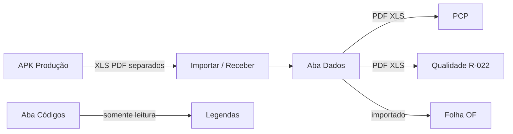

# TOME Líder

**Sistema de recebimento e relatórios PCP / Qualidade**  
TOME S/A — Usinagem

[](./Tome_Lider.apk)
[](https://flutter.dev)
[](./LICENSE)

| | |
|---|---|
| **APK** | [`Tome_Lider.apk`](./Tome_Lider.apk) |
| **Pacote** | `com.tome.lider` |
| **Público** | Líder (celular) — importar e gerar relatórios |
| **Irmão** | [APK-PRODUCAO](https://github.com/ALN2025/APK-PRODUCAO) |

---

## Visão geral

Recebe os arquivos dos operadores e consolida:

| Aba | Função |
|-----|--------|
| **Importar** | Bluetooth / receber direto / XLS / PDF |
| **Dados** | Produção importada + botões **PCP** e **R-022** (PDF/XLS) |
| **Códigos** | **Só consulta** — significado de paradas, sucata, operações e roteiro OF. Não é relatório nem horas negativas |

| Relatório | Origem | Destino |
|-----------|--------|---------|
| **PCP** | Diário | Planejamento |
| **R-022** | Cotas do dia | Qualidade (diário) |
| **Folha OF** | Ordem (fim) | Qualidade — **arquivo separado** do R-022 |

Envio ao time: WhatsApp / Telegram / Email.

---

## Mapa de fluxo



```
Operador envia arquivos SEPARADOS
        │
        ▼
   APK Líder — Importar
        │
        ├─► Dados → PCP (Diário)
        ├─► Dados → R-022 (Qualidade / dia)
        ├─► Dados → Folha OF (Qualidade / fim)
        └─► Códigos → consultar legendas
```

---

## Stack tecnológica

| Camada | Tecnologia |
|--------|------------|
| UI | **Flutter** (Material 3), Dart 3 |
| Persistência | **SQLite** (`sqflite`) — base `tome_lider.db` |
| Import | **file_picker**, parse CSV/XLS |
| Export | **excel** + **pdf** (Noto Sans) |
| Share | **share_plus** (WhatsApp / Telegram / Email) |
| Build | Flavor `lider` (`FLAVOR=lider`) |

Mesmo projeto Flutter do Produção, flavor distinto.

---

## Instalação

1. Desinstale a versão anterior.
2. Instale [`Tome_Lider.apk`](./Tome_Lider.apk).
3. Nome + Setor → Importar → Dados / Códigos.

---

## Compilar

```bash
cd tome_producao
flutter pub get
flutter build apk --release --flavor lider --dart-define=FLAVOR=lider
```

Saída: `build/app/outputs/flutter-apk/app-lider-release.apk`

---

## Assinatura

Rodapé do aplicativo:

<p align="center">
  
</p>

<p align="center"><b>Dev A.L.N</b> · TOME S/A · 2026</p>

---

## Repositórios

- Produção: https://github.com/ALN2025/APK-PRODUCAO  
- Líder: https://github.com/ALN2025/APK-LIDER  
