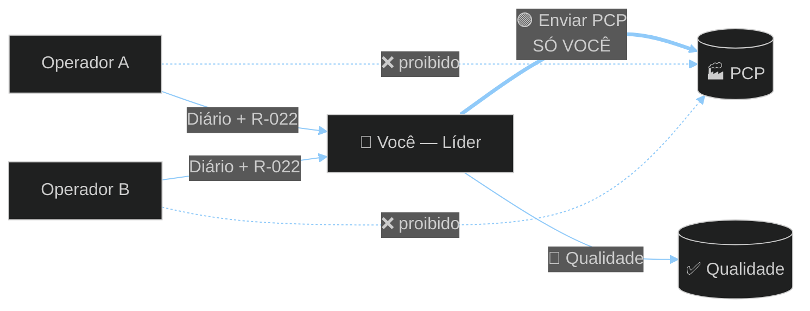
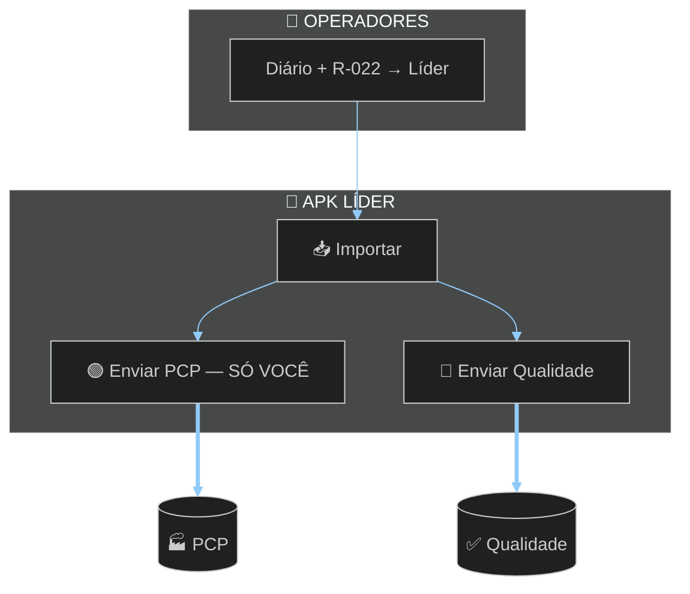

# TOME Líder

### Importar · PCP · Qualidade  
**TOME S/A · Usinagem**

`com.tome.lider` · **único APK que envia ao PCP**

---

 

# 🔀 FLUXO — SÓ O LÍDER ENVIA AO PCP

> Operadores mandam **Diário** e **R-022** para você.  
> **Só você** aperta **Enviar PCP**.

 

 

 

| Botão | O que junta | Destino |
|-------|-------------|---------|
| **Enviar PCP** | Diários | **PCP** — só o líder |
| **Enviar R-022** | Cotas | **Qualidade** |
| Folha OF | Ordem | **Qualidade** (separado) |

---

### [`Tome_Lider.apk`](./Tome_Lider.apk)

### Desenvolvido por **Dev A.L.N** · TOME S/A · 2026

