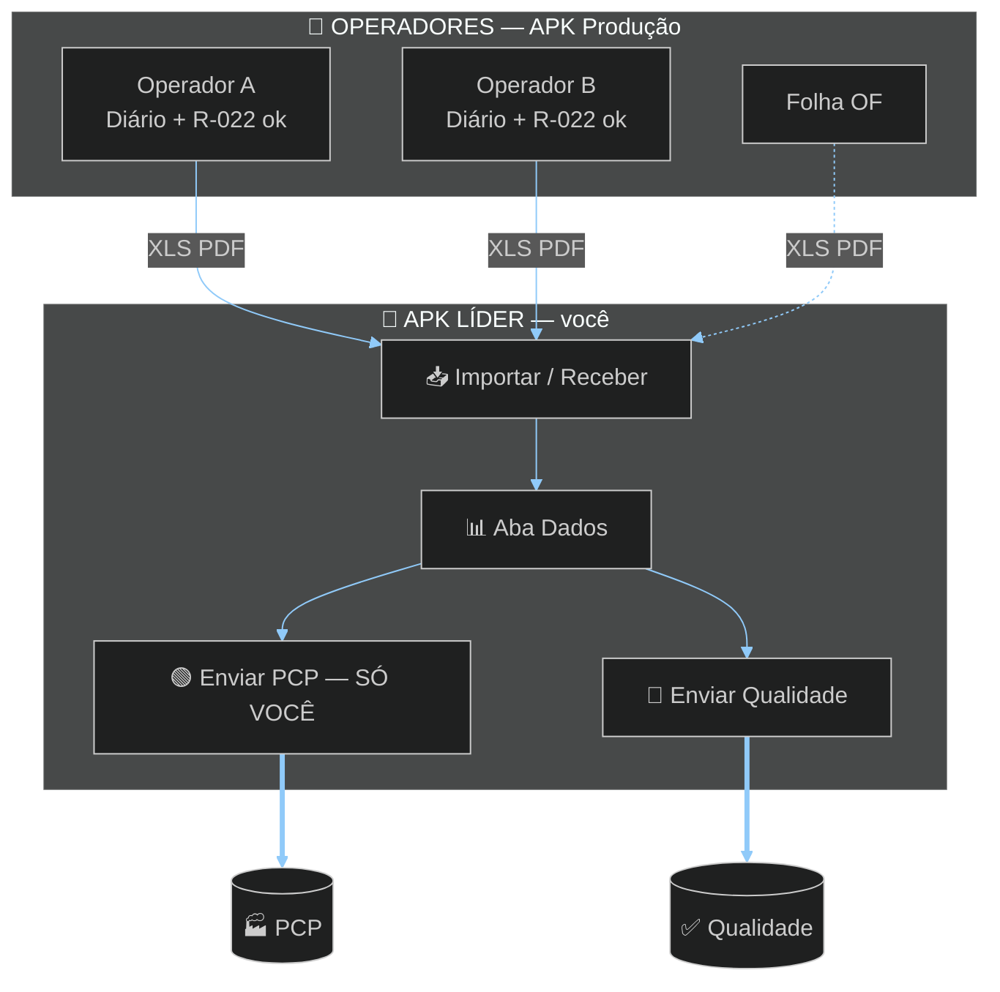

# TOME Líder

### Importar · PCP · Qualidade  
**TOME S/A · Usinagem**

`com.tome.lider` · **único APK que envia ao PCP**

---

 

# 🔀 FLUXOGRAMA — SÓ O LÍDER ENVIA AO PCP

> Operador **pode** mandar Diário e **R-022** a qualquer hora.  
> Você consolida → **Enviar PCP** (só você) / **Enviar Qualidade**.

 

 

| Botão no app | Origem | Destino final |
|--------------|--------|---------------|
| **Enviar PCP** | Diários dos operadores | **PCP** (só o líder) |
| **Enviar R-022** | Cotas recebidas | **Qualidade** |
| Folha OF | Ordem | **Qualidade** (separado) |

---

## Abas

| Aba | Função |
|-----|--------|
| **Importar** | Recebe Diário e R-022 dos operadores |
| **Dados** | **Enviar PCP** · **Enviar Qualidade** |
| **Códigos** | Consultar legendas |

---

## Download

### [`Tome_Lider.apk`](./Tome_Lider.apk)

---

### Desenvolvido por **Dev A.L.N**

[github.com/ALN2025](https://github.com/ALN2025) · TOME S/A · 2026

