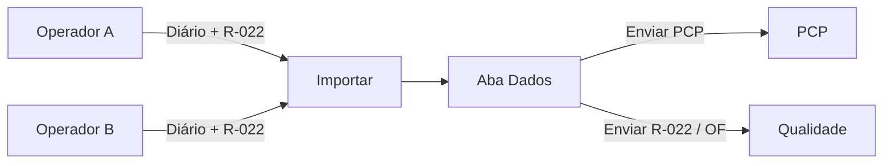

<div align="center">


# TOME Líder

### Importar · PCP · Qualidade  
**TOME S/A · Usinagem**

[](./Tome_Lider.apk)
[](https://github.com/ALN2025/APK-PRODUCAO)
[](https://flutter.dev)

`com.tome.lider` · celular do líder · **único que envia ao PCP**

</div>

---

## Por que este APK?

Os operadores mandam XLS/PDF para você.  
**Só o Líder** consolida e envia:

| Relatório | Origem | Você envia para |
|-----------|--------|-----------------|
| **PCP** | Diários importados | **PCP** |
| **Qualidade R-022** | R-022 do dia | **Qualidade** |
| **Folha OF** | Ordem (quando vier) | **Qualidade** (separado) |

WhatsApp · Telegram · Email — a partir do seu celular.

---

## Fluxo



```
  ┌─────────────┐     XLS/PDF      ┌──────────────┐
  │  Produção   │ ───────────────► │    LÍDER     │
  │  (vários)   │                  │  (este APK)  │
  └─────────────┘                  └──────┬───────┘
                                          │
                         ┌────────────────┼────────────────┐
                         ▼                                 ▼
                   Enviar PCP                        Enviar Qualidade
                   (WhatsApp…)                       (R-022 / Folha OF)
```

---

## Abas

| Aba | Função |
|-----|--------|
| **Importar** | Receber direto / Bluetooth / escolher arquivo |
| **Dados** | Ver produção · **Enviar PCP** · **Enviar R-022** |
| **Códigos** | Só **consultar** legendas (não é relatório) |

---

## Download

### [`Tome_Lider.apk`](./Tome_Lider.apk)

1. Desinstale a versão antiga  
2. Instale o APK  
3. Nome + Setor → Importar → Dados  

---

## Stack

| | |
|---|---|
| UI | Flutter / Dart 3 |
| Banco | SQLite (`tome_lider.db`) |
| Import | `file_picker` · Excel/CSV |
| Export | `excel` + `pdf` |
| Share | `share_plus` |
| Flavor | `lider` |

---

<div align="center">

<br/>


### Desenvolvido por **Dev A.L.N**

[github.com/ALN2025](https://github.com/ALN2025) · TOME S/A · 2026

</div>
