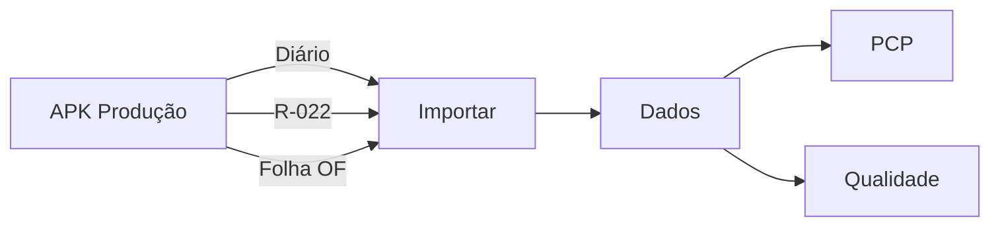

# TOME Líder

**Recebimento e relatórios PCP / Qualidade**  
TOME S/A — Usinagem

[](./Tome_Lider.apk)
[](https://flutter.dev)
[](./LICENSE)

| | |
|---|---|
| **APK** | [`Tome_Lider.apk`](./Tome_Lider.apk) |
| **Pacote** | `com.tome.lider` |
| **Público** | Líder — importar e gerar relatórios |
| **Irmão** | [APK-PRODUCAO](https://github.com/ALN2025/APK-PRODUCAO) |
| **Atualização** | 04/08/2026 |

---

## O que o líder recebe

Do APK Produção (arquivos **separados**):

| Arquivo | Conteúdo | Relatório |
|---------|----------|-----------|
| **Diário** | Qtd produzida + paradas (Legendas) | **PCP** |
| **R-022** | Cotas críticas do dia | **Qualidade** (planilha diária) |
| **Folha OF** | Roteiro OF (quando o operador salvar) | **Qualidade** (não junta com R-022) |

Envio ao time: WhatsApp / Telegram / Email.

---

## Abas

| Aba | Função |
|-----|--------|
| **Importar** | Bluetooth / receber direto / XLS / PDF |
| **Dados** | Ver importado + gerar **PCP** e **R-022** (PDF/XLS) |
| **Códigos** | Só **consultar** legendas (parada, sucata, U/F, roteiro OF). Não é relatório |

---

## Fluxo



---

## Stack

| Camada | Tecnologia |
|--------|------------|
| UI | Flutter / Dart 3 |
| Banco | SQLite (`tome_lider.db`) |
| Import | `file_picker` + Excel/CSV |
| Export | `excel` + `pdf` |
| Share | `share_plus` |
| Flavor | `lider` (`com.tome.lider`) |

---

## Instalação

1. Desinstale a versão antiga.  
2. Instale [`Tome_Lider.apk`](./Tome_Lider.apk).  

---

## Compilar

```bash
flutter build apk --release --flavor lider --dart-define=FLAVOR=lider
```

---

## Assinatura

<p align="center">
  
</p>

<p align="center"><b>Dev A.L.N</b> · TOME S/A · 2026</p>

- Produção: https://github.com/ALN2025/APK-PRODUCAO  
- Líder: https://github.com/ALN2025/APK-LIDER  
